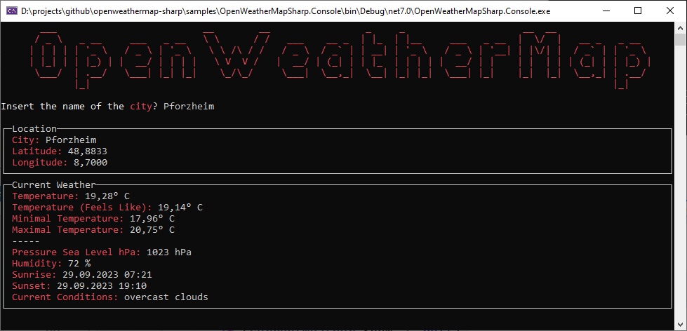

# OpenWeatherMapSharp

A .NET client wrapper for [https://openweathermap.org](https://openweathermap.org) written in .NET Standard 2.0

## Installation

Install the package via [NuGet](https://www.nuget.org/packages/OpenWeatherMapSharp).

[](https://www.nuget.org/packages/OpenWeatherMapSharp)

## Usage

First you need to get a free API key from [openweathermap.org](https://www.openweathermap.org). You can create a new account and you will find your API keys [here](https://home.openweathermap.org/api_keys).

You need to create a new instance of `OpenWeatherMapService` passing in the *API key*. There is also an interface available, if you are using Dependency Injection.

```csharp
/// <summary>
/// Gets forecast data for a location based 
/// on its geographic coordinates.
/// </summary>
Task<OpenWeatherMapServiceResponse<ForecastRoot>> GetForecastAsync(
    double latitude,
    double longitude,
    LanguageCode language = LanguageCode.EN,
    Unit unit = Unit.Standard);

/// <summary>
/// Gets forecast data based on a city ID.
/// </summary>
[Obsolete]
Task<OpenWeatherMapServiceResponse<ForecastRoot>> GetForecastAsync(
    int cityId,
    LanguageCode language = LanguageCode.EN,
    Unit unit = Unit.Standard);

/// <summary>
/// Gets forecast data based on a city name.
/// </summary>
[Obsolete]
Task<OpenWeatherMapServiceResponse<ForecastRoot>> GetForecastAsync(
    string city,
    LanguageCode language = LanguageCode.EN,
    Unit unit = Unit.Standard);

/// <summary>
/// Gets current weather data for a location based on its geographic coordinates.
/// </summary>
Task<OpenWeatherMapServiceResponse<WeatherRoot>> GetWeatherAsync(
    double latitude,
    double longitude,
    LanguageCode language = LanguageCode.EN,
    Unit unit = Unit.Standard);

/// <summary>
/// Gets current weather data based on a city ID.
/// </summary>
[Obsolete]
Task<OpenWeatherMapServiceResponse<WeatherRoot>> GetWeatherAsync(
    int cityId,
    LanguageCode language = LanguageCode.EN,
    Unit unit = Unit.Standard);

/// <summary>
/// Gets current weather data based on a city name.
/// </summary>
[Obsolete]
Task<OpenWeatherMapServiceResponse<WeatherRoot>> GetWeatherAsync(
    string city,
    LanguageCode language = LanguageCode.EN,
    Unit unit = Unit.Standard);

/// <summary>
/// Gets a list of matching locations for a given query string.
/// </summary>
Task<OpenWeatherMapServiceResponse<List<GeocodeInfo>>> GetLocationByNameAsync(
    string query,
    int limit = 5);

/// <summary>
/// Gets geolocation information based on a ZIP or postal code.
/// </summary>
Task<OpenWeatherMapServiceResponse<GeocodeZipInfo>> GetLocationByZipAsync(
    string zipCode);

/// <summary>
/// Gets a list of matching locations for a given pair of coordinates.
/// </summary>
Task<OpenWeatherMapServiceResponse<List<GeocodeInfo>>> GetLocationByLatLonAsync(
    double latitude,
    double longitude,
    int limit = 5);

/// <summary>
/// Retrieves current air pollution data for a specific location.
/// </summary>
Task<OpenWeatherMapServiceResponse<AirPolutionRoot>> GetAirPolutionAsync(
    double latitude,
    double longitude);

/// <summary>
/// Retrieves forecasted air pollution data for the coming days for a specific location.
/// </summary>
Task<OpenWeatherMapServiceResponse<AirPolutionRoot>> GetAirPolutionForecastAsync(
    double latitude,
    double longitude);

/// <summary>
/// Retrieves historical air pollution data for a specific location and time range.
/// </summary>
Task<OpenWeatherMapServiceResponse<AirPolutionRoot>> GetAirPolutionHistoryAsync(
    double latitude,
    double longitude,
    DateTime start,
    DateTime end);
```

***HINT:*** Some methods are marked as `obsolete`, because [openweathermap.org](https://openweathermap.org) marked these methods as depracted. Currently they are all still working, but might be removed in feature releases. They recommend using the methods with *latitude* and *longitude* to get the current weather or the forecast.

## Sample

Here is a screenshot of the `Console Application` using the [NuGet package](https://www.nuget.org/packages/OpenWeatherMapSharp) to get the current weather for a provided city.



## Buy Me A Coffee

I appreciate any form of support to keep my *Open Source* activities going.

Whatever you decide, be it reading and sharing my blog posts, using my NuGet packages or buying me a coffee/book, thank you ❤️.

[](https://www.buymeacoffee.com/tsjdevapps)

## Contributing

Pull requests are welcome. For major changes, please open an issue first
to discuss what you would like to change.

Please make sure to update tests as appropriate.

## License

[MIT](https://choosealicense.com/licenses/mit/)
